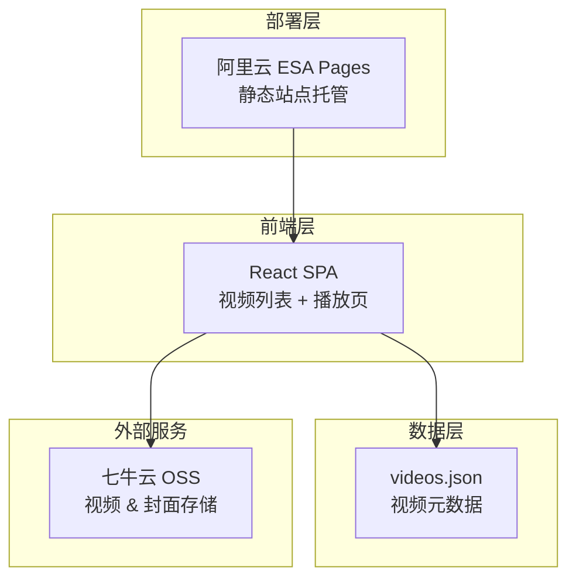
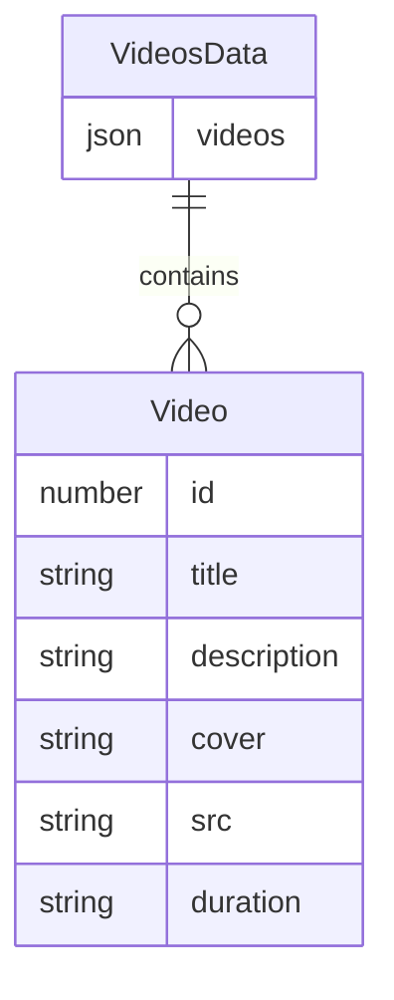

## 1. 架构设计



## 2. 技术说明

- 前端：React@18 + Tailwind CSS@3 + Vite
- 初始化工具：Vite (npm create vite@latest)
- 后端：无（纯静态站点）
- 数据库：无（使用 videos.json 静态数据文件）
- 视频播放器：Video.js v8（通过 @videojs-player/react 或直接集成）
- 视频存储：七牛云 OSS（外部服务，通过 URL 直接访问）
- 部署：阿里云 ESA Pages（静态站点托管，自动构建部署）

## 3. 路由定义

| 路由 | 用途 |
|------|------|
| / | 视频列表页，展示所有视频封面网格 |
| /play/:id | 视频播放页，播放指定 ID 的视频 |

## 4. API 定义

无后端 API。前端直接读取项目内的 videos.json 文件获取视频列表数据。

### 数据结构定义

```typescript
interface Video {
  id: number;
  title: string;
  description: string;
  cover: string;
  src: string;
  duration: string;
}

interface VideosData {
  videos: Video[];
}
```

## 5. 服务器架构图

不适用（纯静态站点，无后端服务器）

## 6. 数据模型

### 6.1 数据模型定义



### 6.2 数据定义

使用 videos.json 静态文件存储视频信息，无需数据库建表。文件格式如下：

```json
{
  "videos": [
    {
      "id": 1,
      "title": "示例视频1",
      "description": "这是第一个示例视频",
      "cover": "https://your-bucket.oss-cn-beijing.aliyuncs.com/covers/cover1.jpg",
      "src": "https://your-bucket.oss-cn-beijing.aliyuncs.com/videos/video1.mp4",
      "duration": "05:32"
    }
  ]
}
```
